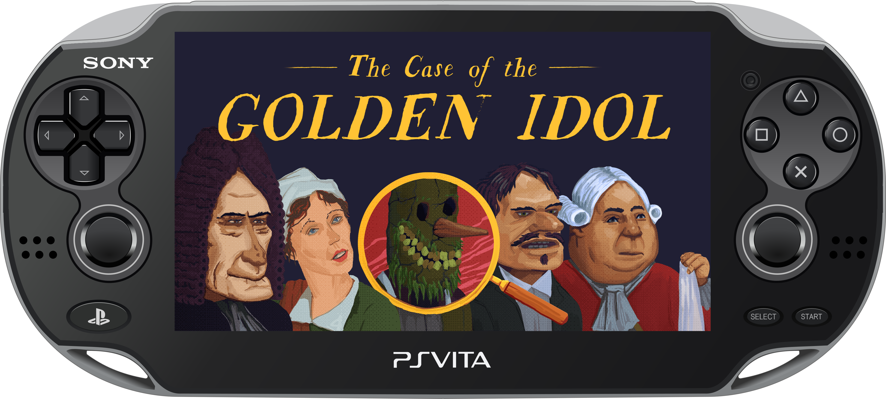
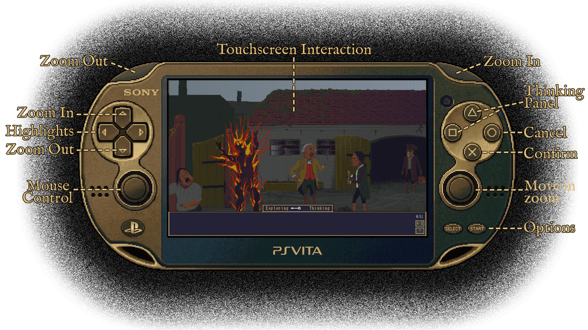
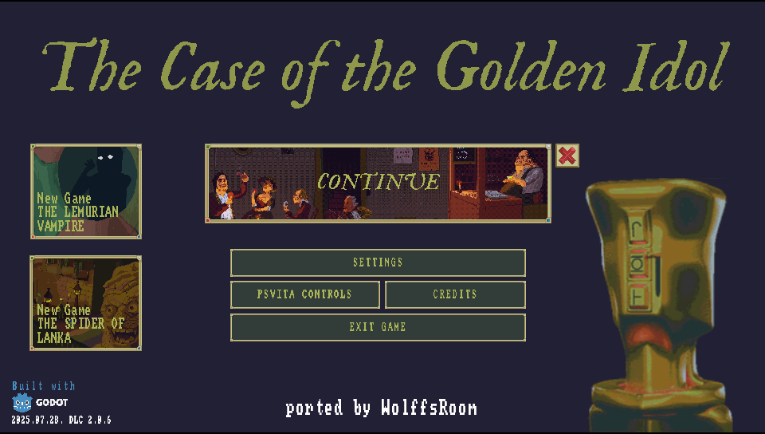
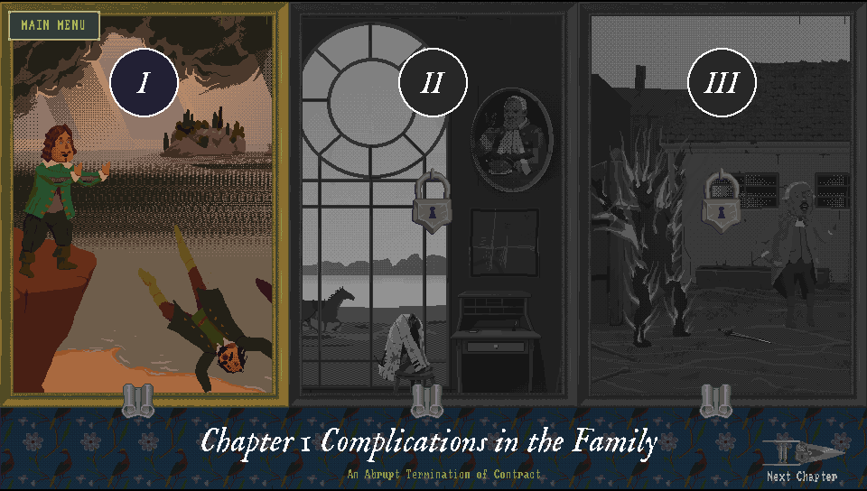
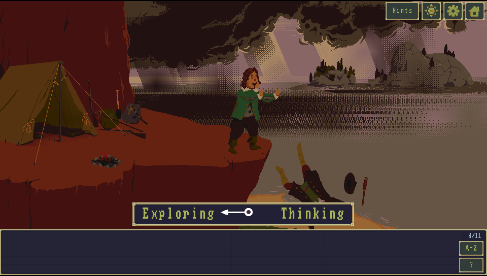
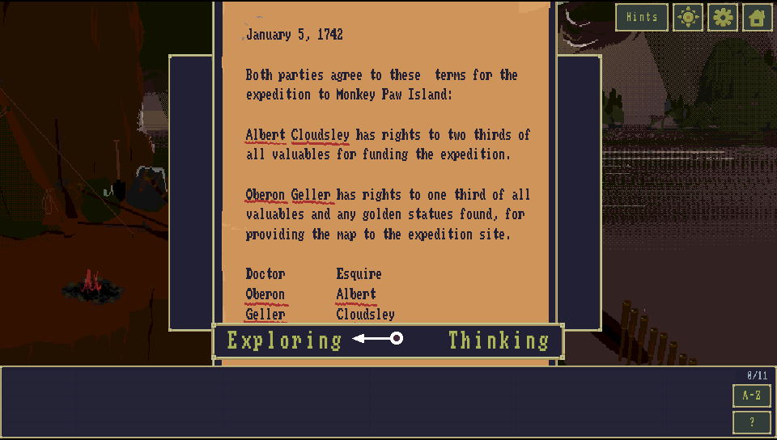
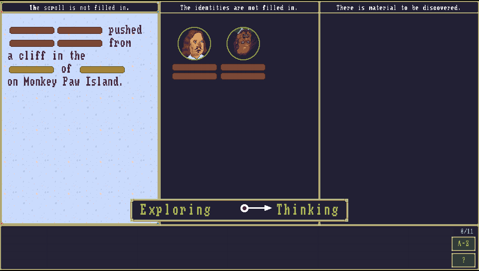
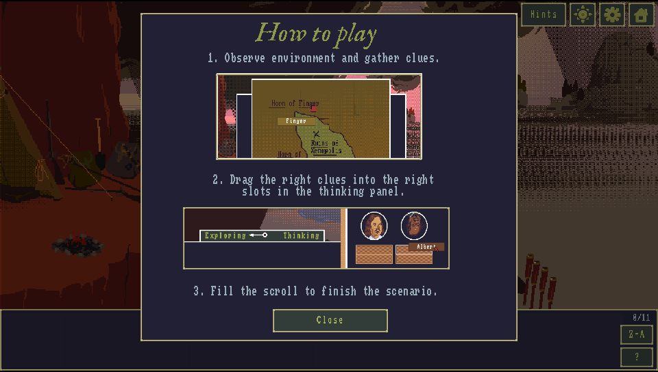

  

# The Case of the Golden Idol - PS Vita Port

A port of **The Case of the Golden Idol** for the PlayStation Vita, adapted from the original Godot Engine PC release. This repository contains the source scripts, patching engines, and tools created to adapt the game to run natively on the PS Vita hardware.

## Installation

1. Head to the **[Releases](../../releases)** tab.
2. Download the latest `GoldenIdol-Patch.zip` and `GoldenIdol-Vita-x.x.x.vpk`.
3. Extract `GoldenIdol-Patch.zip` into a new folder on your PC.

### HOW TO APPLY THE PATCH:
1. Open Steam, right-click on "The Case of the Golden Idol", go to **Manage -> Browse local files**.
2. Copy the file named `game.pck` from that folder.
3. Paste the `game.pck` file **EXACTLY INTO THE `DataSteam` FOLDER** of your extracted patcher.
4. Go back to the main patcher folder and run `ApplyPatch.bat`. Follow the on-screen instructions to select your language.
5. Wait for the process to finish. It will automatically apply the patch and create a new folder named `game_data` containing your patched game file.
6. Install the `GoldenIdol-Vita-X.X.X.vpk` on your PS Vita using VitaShell or **[FMVita](https://github.com/WolffsRoom/FMVita)** (my personalized VitaShell).
7. Connect your Vita via FTP or USB, and copy the entire newly created `game_data` folder into your Vita's game app folder at:
   `ux0:app/IDOL00001/`
   *(This ensures the file ends up exactly at `ux0:app/IDOL00001/game_data/game.pck`, not just the root app folder).*
8. Have fun!

> **⚠️ Note**: You MUST own the original game on Steam to generate the Vita playable files. No game assets are provided in this repository.

> **UPDATE WARNING**: IF YOU WANT TO UPDATE THE GAME, UPDATE THE GAME FILES TOO, NOT JUST VPK

---

## Controls (Controles)

  

| Control | Action | Control | Action |
|:---:|:---|:---:|:---|
|   | Zoom In / Zoom Out |  | Confirm / Interact |
|  | Show / Hide highlights |  | Cancel / Back |
|  | Move while zoomed |   | Open Thinking Panel |
|  | Mouse control | **SELECT** | Options |
|  | Interact (click) | | |

---

## Screenshots

  
  
  
  
  
  

---

## Main Tools Used

This port was made possible thanks to the following incredible tools:

### **GDRE_Tools**
- **Purpose**: Used to extract the original PCK from the Steam version, allowing the project to be reconstructed and opened in the Godot Engine.
- **Source**: [https://github.com/GDRETools/gdsdecomp](https://github.com/GDRETools/gdsdecomp)

### **GODOT PSVita**
- **Purpose**: Used to compile the final `.vpk` for the Vita, and modify essential game files to improve the interface and adapt playability for the console.
- **Source**: [https://github.com/SonicMastr/godot-vita](https://github.com/SonicMastr/godot-vita)

### **AssetStudio**
- **Purpose**: Used to explore the files of the Unity version of the game (REDUX version), with the main goal of creating a tool to migrate the newly translated languages back to the Godot version.
- **Note**: The translation project is still a work-in-progress, I currently adding accentuation support to the TTF fonts used by the game.
- **Source**: [https://github.com/Perfare/AssetStudio](https://github.com/Perfare/AssetStudio)

---

## Python Automation Tools

A set of `.py` tools automate the adjustments needed to fit the PC assets within the PS Vita constraints. They now live in the `Tools/` folder, organised by category (see `Tools/README.md` for full details and usage):

**`Tools/stex/`** — low-level `.stex` (StreamTexture) format operations
| Script | Purpose |
| :--- | :--- |
| `fix_vram_textures.py` | Repoints VRAM (mode=2) textures to the RGBA4444 variant the Vita can actually render (fixes white/black textures). |
| `fix_webp_stex.py` | Swaps large lossless-WebP `.stex` that the Vita can't decode for their uncompressed variant. |
| `halve_stex.py` | Downscales an uncompressed RGBA4444 `.stex` 2x (packing-agnostic). |
| `resize_stex.py` | Fractional (num/den) downscale of an uncompressed RGBA4444 `.stex`. |

**`Tools/textures/`** — texture / asset optimisation
| Script | Purpose |
| :--- | :--- |
| `lossless_vita_optimizer.py` | Repacks oversized textures into Power-of-Two grids and rewrites the scene `Rect2` coords. |
| `build_beach_textures.py` | Rebuilds the DLC beach scene textures (dithered RGBA4444 + frame repack) for CDRAM. |
| `adjust_anim.py` | Choreographs the custom "Ported by WolffsRoom" splash animation into the boot sequence. |
| `fix_idol_animation.py` | Restores the splash statue atlas and applies bilinear filter + scale tweaks. |

**`Tools/project/`** — project hygiene
| Script | Purpose |
| :--- | :--- |
| `cleanup_unused.py` | Detects and moves unused scenes + prototype images out of the build (smaller PCK), with an undo manifest. |
| `restore_imports.py` | Selective import strategy (lossless for NPOT, VRAM for POT) to avoid the PowerVR GPU crash. |

**`Tools/vita/`** — Vita platform configuration
| Script | Purpose |
| :--- | :--- |
| `apply_vita_settings.py` | Forces the Vita target settings into `project.godot`. |
| `patch_sfo_extended_memory.py` | Patches `PARAM.SFO` for the extended memory mode. |

**`Tools/patches/`** — GDScript / content patches
| Script | Purpose |
| :--- | :--- |
| `fix_steam_issues.py` | Removes Steamworks dependencies that would crash the console runtime. |
| `patch_dlcs_v2.py` | Unlocks both DLCs (*Spider of Lanka* & *Lemurian Vampire*) locally. |
| `patch_credits_v4.py` | Injects the custom port splash into the boot/credits sequence. |
| `improvements.py` | Input/control rewrites (virtual cursor, zoom, Select -> cancel). |

**`Tools/trophy/`** — trophies
| Script | Purpose |
| :--- | :--- |
| `build_trp.py` | Packs the Steam-derived trophy set into a PS Vita `TROPHY.TRP` (NoTrpDrm format). |

> The distributable patcher engine (`build_patch.py`, `patch_apply.py`, `patch_engine_animated.py`) ships with the patcher in the Releases tab.

---

## Improvements for the PS Vita

Since this port is based on the Godot version, I took the liberty (as it was easy) of reworking several parts of the game to make it feel native on the console:

**Controls & input**
- **Mouse support:** Virtual cursor/mouse system driven by the analog stick.
- **Reworked controls:** Replaced the original Xbox-style scheme to make better use of the PS Vita's buttons.
- **Help screen:** The on-screen command list now shows the real PS Vita controls instead of the PC ones.
- **"O" (Cancel) fix:** It was mapped to both *accept* and *cancel*, causing menus to close and immediately reopen; it now performs cancel only.
- **Mouse Speed setting:** Configurable cursor speed slider under Settings.

**Zoom**
- **Progressive zoom:** Holding L/R or D-Pad Up/Down now zooms smoothly (continuous) instead of fixed steps, both for the scene camera and the Thinking Panel.
- **Thinking Panel zoom:** Zoom the deduction board (up to 3x) to read the text on the small screen, with an opaque backdrop so the game scene is never exposed at the edges.
- **Hint zoom:** The hint illustrations can be zoomed and panned the same way.

**Visual & UI**
- **Touch-optimized screens:** Reworked screens such as the main menu (`splash_screen_dlc`) for the touch screen.
- **Screen-opening animations:** Added/improved animations for menus, dialogs and transitions.
- **Scene-only transitions:** The black transition between locations now only covers the scene, keeping the toolbar visible.
- **Overhauled Credits & Discord supporters screens:** Rolling credits that return automatically when finished.
- **Brightness setting:** New Settings slider that fades the screen darker or lighter.
- **Object-description box:** Fixed the text centering inside the item description box.

**Audio & video**
- **Volume sync fix:** Corrected volume synchronization in the project.
- **Intermission videos:** Re-encoded to a lighter resolution for smoother playback, with the scenario selector hidden behind the video to reduce GPU load.

**Performance & footprint**
- **DLC crash fix:** Resolved the `C2-12828-1` out-of-memory crash on the *Mystery of Monkey Paw Island* DLC scene.
- **Texture rendering fixes:** Fixed white/black VRAM textures (DLC splash) and related memory adjustments.
- **Project cleanup:** Unused scenes and prototype images moved out of the build for a smaller PCK.

---

## Planned Improvements
- **v0.8.0**
  - Put trophy support.
  - Set a performance improvements during scenario transitions.
- **v0.9.0**
  - Put support for the OST DLC.
- **v1.0.0**
  - Put language switching in the patcher for the generated PCK, using data from the Unity version.

---

## Known Issues
- Just a slightly longer loading time for screens and levels, nothing serious (about 5 seconds).

---

## IA Notice

This project utilized **Gemini 3.1 Pro** through the **Antigravity IDE** to optimize the creation of the Python scripts, compile differential patchers, and automate the extensive pipeline needed to port the *Golden Idol* Godot project to the PS Vita.

---

Follow my other work here as well:
[https://wolffsroom.wordpress.com/](https://wolffsroom.wordpress.com/)
